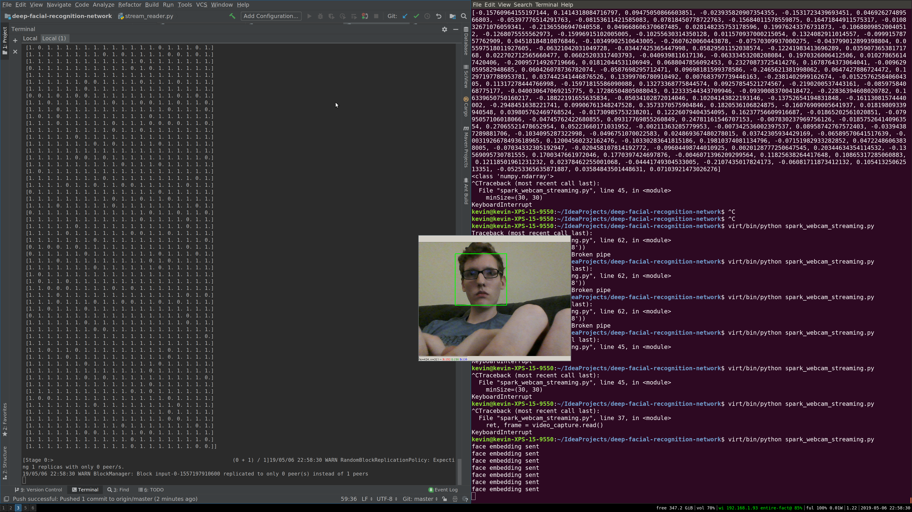

# deep-facial-recognition-network

This is an assignment for GSU's Big Data course on attempting to make a facial recognition system
using deep belief networks consisting of Restricted Boltzmann Machines, operated with Spark Streaming.

## Instructions
After setting up a sufficient environment, run spark_webcam_streaming.py on a laptop with a webcam, then run 
stream_reader.py. spark_webcam_streaming.py will only start working after a socket is established with 
stream_readder.py.

## Files
* spark_webcam_streaming.py generates embeddings from faces identified on your computers webcam,
then sends them over a socket to a Spark Streaming Context.

* stream_reader.py contains a Spark Streaming Context that reads face embeddings off a socket, then 
generates hidden states of an RBM using pre-calculated weights provided.

* embedding_generator.py is a file from https://github.com/ageitgey/face_recognition/blob/master/face_recognition/api.py 
that takes an image of a face and generates a 128 point vector of characteristics of the face.

* rbm.py is used to generate weights for an RBM. It has a set of 11 pieces of sample embeddings, all of my face.

* haarcascade_frontalface_default.xml is a pre-trained classifier for identifying faces provided by opencv.
It is used in spark_webcam_streaming.py and training_set_generator.py

* rbmWeights.csv contains weights gotten from training an RBM using rbm.py

* example_rbmpy_output.txt is an example of the output from rbm.py, with the iteration costs and weights outputted

##  References
Files referenced include 
* https://github.com/ageitgey/face_recognition/blob/master/face_recognition/api.py,
* https://github.com/shantnu/Webcam-Face-Detect/blob/master/webcam_cv3.py, and
* https://github.com/echen/restricted-boltzmann-machines/blob/master/rbm.py .

## Example of the program running
When the program is running it shouldd look something like this 

